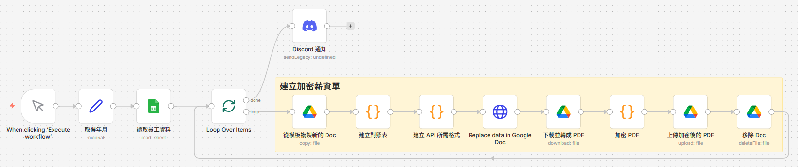

# Workflows 工作流程介紹

這個目錄包含各種自動化工作流程。下面介紹每個工作流程的功能和使用方式。

## 1. 加密薪資單產生器
**檔案名:** [`1_Batch_Encrypted_Payroll_Generator.json`](./1_Batch_Encrypted_Payroll_Generator.json)

### 功能描述
這個工作流程自動化了加密薪資單的生成過程，將原本繁瑣的手動操作轉換為一鍵執行。

**核心步驟：**
1. 從 Google Sheets 讀取員工資料（員工編號、身分證字號等）
2. 從 Google Docs 模板批量複製文檔
3. 使用員工資料動態替換模板中的佔位符
4. 將 Google Docs 轉換為 PDF 格式
5. 使用員工身分證字號作為密碼加密 PDF（使用 `muhammara` npm 套件）
6. 將加密後的 PDF 上傳回 Google Drive 指定資料夾
7. 清理臨時的 Google Docs 檔案
8. 發送 Discord 通知確認完成

詳細說明

### 技術特點

- **加密方式：** 使用 `muhammara` npm 套件實現 PDF 加密，提供使用者密碼和所有者密碼保護
- **大量資料處理：** 支持批量處理多名員工，自動循環執行
- **Google 服務整合：** 整合 Google Sheets、Google Docs、Google Drive API
- **通知機制：** 透過 Discord webhook 發送執行完成通知

### 前置要求
- 配置 Google Sheets 認證（用於讀取員工資料）
- 配置 Google Docs 認證（用於建立和編輯薪資單文檔）
- 配置 Google Drive 認證（用於下載、上傳和刪除檔案）
- 配置 Discord webhook（用於發送完成通知）
- 需要在 n8n 容器中安裝 `muhammara` npm 套件

### 使用步驟
1. 在 Google Sheets 中準備好員工資料（需配置資料來源連結）
2. 在 n8n 中打開此工作流程
3. 點擊「Execute Workflow」按鈕運行
4. 等待 Discord 通知確認完成
5. 在 Google Drive 中查看生成的加密 PDF 檔案

